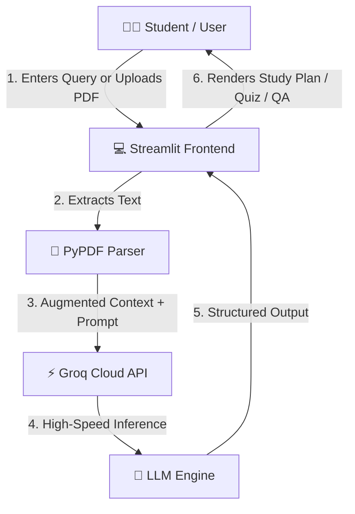

# 🎓 GenAI Learning Mentor

An intelligent academic tutor and revision assistant built with Streamlit, Groq Cloud API, and RAG (Retrieval-Augmented Generation) to help university students master complex subjects and prepare for exams.

---

## 📌 Problem Statement
Students often struggle to digest lengthy textbook materials, identify high-priority exam topics, and test their understanding dynamically before university examinations. This project provides personalized, adaptive tutoring, automated study roadmaps, and instant practice quizzes anchored directly to uploaded course notes.

---

## 🏗️ Architecture & Data Flow



---

## ✨ Features
* **📚 Dynamic RAG Document QA:** Upload syllabus or lecture notes (PDF) to ground LLM responses in actual course materials.
* **💬 Concept Explanation Agent:** Clear, step-by-step academic explanations designed for theory exam scoring.
* **📝 Automated Study Roadmaps:** Generates customized multi-day revision plans targeting high-weightage topics.
* **🎯 Practice Quiz Generator:** Automatically produces multiple-choice quizzes with answers and detailed rationales.

---

## 🛠️ Tech Stack
* **Language:** Python 3.9+
* **Frontend / UI:** Streamlit
* **LLM Engine:** Groq API (High-speed cloud inference)
* **Document Processing:** PyPDF
* **Environment Management:** Python-Dotenv

---

## 🚀 Setup & Installation

1. **Clone the repository:**
   ```bash
   git clone [https://github.com/HarshitG2006/GenAI_learning_assistant.git](https://github.com/HarshitG2006/GenAI_learning_assistant.git)
   cd GenAI_learning_assistant
   ```

2. **Install dependencies:**
   ```bash
   pip install -r requirements.txt
   ```

3. **Configure Environment Variables:**
   Create a `.env` file in the root directory:
   ```env
   GROQ_API_KEY=your_groq_api_key_here
   ```

4. **Run the Application:**
   ```bash
   streamlit run app.py
   ```

---

## 🎯 Prompt Engineering & Agent Roles
* **Tutor Role:** Configured via system prompts to provide step-by-step breakdowns, key definitions, and exam tips.
* **Strategist Role:** Designs time-boxed revision schedules aligned with academic days.
* **Examiner Role:** Generates structured multiple-choice questions with answer evaluation criteria.

---

## 🔮 Future Enhancements
* Integration of vector databases (ChromaDB / FAISS) for dense chunk-level vector search.
* Multi-PDF document merging and citation highlighting.
* Support for voice input and audio flashcard generation.